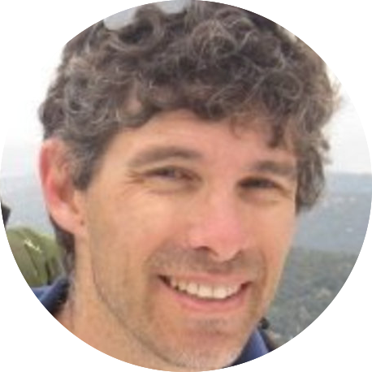
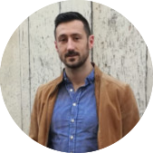
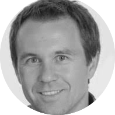

**Unmanned Aircraft Systems (UAS)** have been employed for a wide variety of applications, such as environmental studies, emergency responses or package delivery. Safe operation of fully autonomous UAS requires robust perception systems. In the SUADD workshop, we will focus on the **estimation of the depth and the semantic segmentation of the scene**. The results of these two tasks can help the development of safe and reliable autonomous control systems for the aircraft. This workshop is part of a wider initiative at [**Amazon Prime Air**](https://www.aboutamazon.de/news/innovationen/prime-air), which includes the organization of a challenge on semantic segmentation and mono-depth estimation of drone images, which had hundreds of participants. The images of the dataset of the challenge comprised realistic backyard scenarios of variable content and have been taken on various Above Ground Level (AGL) ranges. With this workshop and challenge we aim to inspire the Computer Vision community to develop new insights and advance the state of the art in perception tasks involving drone images. The workshop will also include talks by invited speakers.

# Invited Speakers

| <!-- -->    | <!-- -->    |
|-------------|-------------|
| (picture) | **Dengxin Dai** is a Senior Researcher at MPI for Informatics and a external Lecturer at ETH Zürich, and head of the research group Vision for Autonomous Systems. He has done novel work in the semantic segmentation of autonomous driving scenes as well as depth perception. |
| (picture) | **Daniel Gehrig** is a PhD student at the "Robotics and Perception Group" led by Prof. Dr. Davide Scaramuzza at the University of Zurich and ETH Zurich. His research focuses on high-speed and high-dynamic range visual perception using Event Cameras |
| (picture) | TBA |

# Organizers

| <figure>[Amir Navot](https://www.linkedin.com/in/amir-navot-7939101/)</figure>   | <figure>[Borja Bovcon]()</figure>   | <figure>[Yuri Federigi](https://www.linkedin.com/in/yuri-federigi/)</figure>   |
|-------------|-------------|-------------|
| <figure>[**Christian Leistner**](https://www.linkedin.com/in/christian-leistner-92349583/)</figure>   | <figure>[**Patrick Knoebelreiter**]()</figure>   |<figure>[**Elisa de Llano**]()</figure> |
| <figure>[**Andrea Maracani**]()</figure> | <figure>[**Christian Reinbacher**]()</figure> | <figure>[**Markus Unger**]()</figure> |
