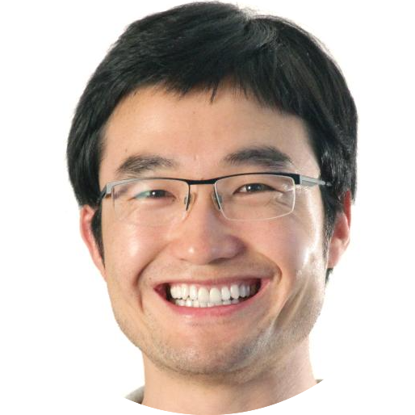
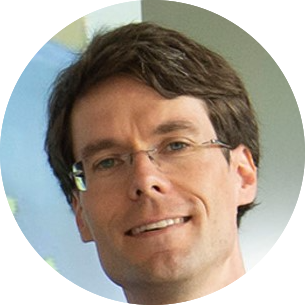
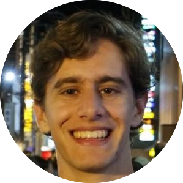
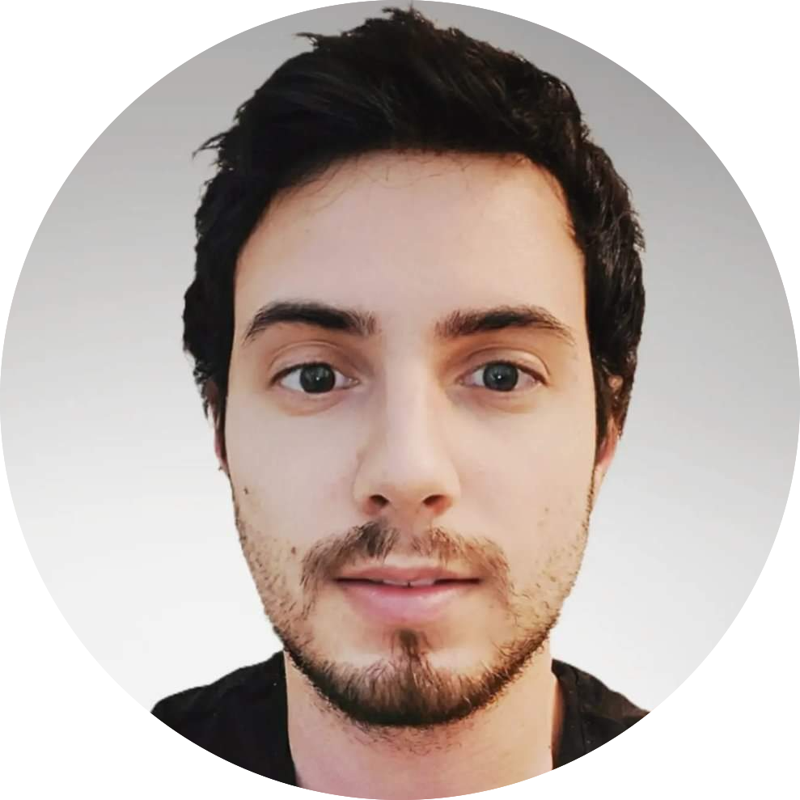
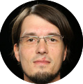

**Unmanned Aircraft Systems (UAS)** have been employed for a wide variety of applications, such as environmental studies, emergency responses or package delivery. Safe operation of fully autonomous UAS requires robust perception systems. In the SUADD workshop, we will focus on the **estimation of the depth and the semantic segmentation of the scene**. The results of these two tasks can help the development of safe and reliable autonomous control systems for the aircraft. This workshop is part of a wider initiative at [**Amazon Prime Air**](https://www.aboutamazon.de/news/innovationen/prime-air), which includes the organization of a challenge on semantic segmentation and mono-depth estimation of drone images, which had hundreds of participants. The images of the dataset of the challenge comprised realistic backyard scenarios of variable content and have been taken on various Above Ground Level (AGL) ranges. With this workshop and challenge we aim to inspire the Computer Vision community to develop new insights and advance the state of the art in perception tasks involving drone images. The workshop will also include talks by invited speakers.

# Invited Speakers

| <!-- -->    | <!-- -->    |
|-------------|-------------|
| <figure style="text-align: center; width: 200px;">[**Dengxin Dai**](https://www.mpi-inf.mpg.de/departments/computer-vision-and-machine-learning/people/dengxin-dai)</figure> | Senior Researcher at MPI for Informatics and a external Lecturer at ETH Zürich, and head of the research group Vision for Autonomous Systems. He has done novel work in the semantic segmentation and depth perception of autonomous driving scenes. |
| <figure style="text-align: center;">[**Jürgen Gall**](https://pages.iai.uni-bonn.de/gall_juergen/) </figure> | Professor and head of the Computer Vision Group at the University of Bonn since 2013, spokesperson of the  Transdisciplinary Research Area “Mathematics, Modelling and Simulation of Complex Systems”, and member of the Lamarr Institute for Machine Learning and Artificial Intelligence. After his Ph.D. in computer science from the Saarland University and the Max Planck Institute for Informatics, he was a postdoctoral researcher at the Computer Vision Laboratory, ETH Zurich, from 2009 until 2012 and senior research scientist at the Max Planck Institute for Intelligent Systems in Tübingen from 2012 until 2013. He received a grant for an independent Emmy Noether research group from the German Research Foundation (DFG) in 2013, the German Pattern Recognition Award of the German Association for Pattern Recognition (DAGM) in 2014, an ERC Starting Grant in 2016, and an ERC Consolidator Grant in 2022. He is further spokesperson of the DFG funded research unit [“Anticipating Human Behavior”](http://for2535.cv-uni-bonn.de) and PI of the Cluster of Excellence [“PhenoRob – Robotics and Phenotyping for Sustainable Crop Production”](http://www.phenorob.de). |
| <figure style="text-align: center;">[**Daniel Gehrig**](https://danielgehrig18.github.io/) </figure> | Ph.D. Student at the Robotics and Perception Group (RPG), at the University of Zurich / ETH Zurich, Switzerland. His research interests lie at the intersection of robotics, computer vision, and machine learning for event-based vision, for which he was awarded among others, the ETH Medal, for the best Master Thesis. His contributions include novel approaches to domain transfer, representation learning, and efficient multimodal perception with event cameras and target robotic and automotive settings. |

# Organizers

| <figure style="text-align: center;">[Amir Navot](https://www.linkedin.com/in/amir-navot-7939101/)</figure> | <figure style="text-align: center;">[Borja Bovcon](https://si.linkedin.com/in/borja-bovcon)</figure>   | <figure style="text-align: center;">[Yuri Federigi](https://www.linkedin.com/in/yuri-federigi/)</figure>   |
|-------------|-------------|-------------|
| <figure style="text-align: center;">[**Christian Leistner**](https://www.linkedin.com/in/christian-leistner-92349583/)</figure>   | <figure style="text-align: center;">[**Patrick Knoebelreiter**]()</figure>   |<figure style="text-align: center;">[**Elisa de Llano**](https://www.linkedin.com/in/elisa-d-a7bba1199/)</figure> |
| <figure style="text-align: center;">[**Andrea Maracani**](https://maracani.xyz/)</figure> | <figure style="text-align: center;">[**Christian Reinbacher**](https://at.linkedin.com/in/christian-reinbacher-a7775969)</figure> | <figure style="text-align: center;">[**Markus Unger**](https://at.linkedin.com/in/markus-unger-486822100)</figure> |
